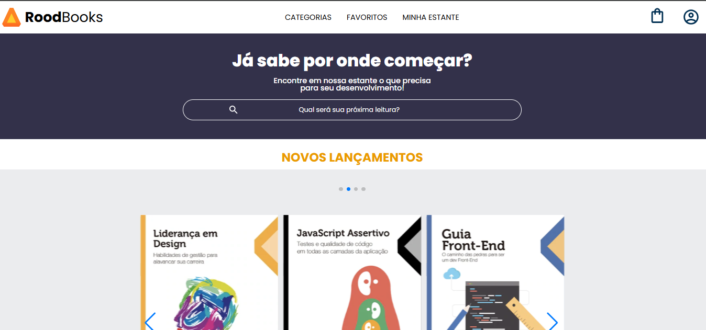

# 📚 Rodbooks

Rodbooks é um projeto de front-end desenvolvido com React que simula uma livraria online ou estante digital de livros para programadores. A proposta é criar um ambiente limpo, navegável e intuitivo para buscar livros por categoria, favoritar títulos e montar uma estante personalizada.

---
## 📸 Demonstração


![Rodbooks Screenshot]

## 🚀 Tecnologias utilizadas

- React
- React Router DOM
- CSS3
- HTML5
- JavaScript (ES6+)
- Create React App

---

## ⚙️ Funcionalidades

- Navegação por páginas (SPA) usando React Router
- Carrossel de novos lançamentos
- Busca de livros
- Estante de livros favorita (em construção)
- Layout responsivo (em desenvolvimento)

---

## 🖥️ Como executar localmente

```bash
# Clone o repositório
git clone https://github.com/rodDev288/rodbooks.git

# Acesse o diretório
cd rodbooks

# Instale as dependências
npm install

# Inicie a aplicação
npm start
